# Sweep Internals

## How a Sweep Runs

This applies to all samplers. The sampler controls two things: which
parameters to try next (`before_trial`) and when to stop (`after_trial` /
preemption). Everything else is shared.

```
run_sweep                                         [runner.py]
  |
  |-- Create/load Optuna study + MLflow parent run
  |-- Sync: void any Optuna trials whose MLflow runs were deleted
  |-- Early exit if study already complete (sampler.is_exhausted)
  |
  |-- OPTIMIZATION LOOP (up to n_trials iterations)
  |     |
  |     |-- study.ask() creates a new trial (RUNNING state)
  |     |     \__ calls sampler.before_trial(study, trial)
  |     |           Sampler decides what params this trial should use,
  |     |           or marks it PREEMPTED if no work remains.
  |     |
  |     |-- Trial preempted?
  |     |     YES --> set trial state to PRUNED, call study.stop(), continue
  |     |     NO  --> run the subprocess (run_experiment)
  |     |
  |     |-- Subprocess exits
  |     |     exit 0 --> Optuna state = COMPLETE, MLflow status = FINISHED
  |     |     exit 1 --> raise TrialRunError (caught by loop, not fatal)
  |     |                Optuna state = FAIL, MLflow status = FAILED
  |     |                (--abort-on-fail raises TrialRunAbortError instead,
  |     |                 which IS fatal and kills the sweep)
  |     |
  |     |-- sampler.after_trial(study, trial, state, values)
  |     |     Sampler may call study.stop() here to end the loop early.
  |     |
  |     v (next iteration, or break if stop_flag / n_trials / timeout)
  |
  |-- Set parent MLflow run status: FINISHED if complete, else RUNNING
```

## Grid Sampler

```mermaid
flowchart TD
    Start([run_sweep]) --> Init[Create/load Optuna study<br>+ MLflow parent run]
    Init --> Sync[Sync: void Optuna trials<br>whose MLflow runs were deleted]
    Sync --> Complete{Study already<br>complete?}
    Complete -- YES --> DoneEarly([Return early])
    Complete -- NO --> Loop

    subgraph Loop [Optimization Loop]
        Ask[study.ask<br>Creates trial in<br>RUNNING state] --> BeforeTrial

        subgraph BeforeTrial [GridSampler.before_trial]
            Lock[Acquire FileLock] --> Pending[Compute pending grid IDs]
            Pending --> HasPending{Pending IDs<br>exist?}
            HasPending -- YES --> Assign[Assign random<br>pending grid ID<br>to trial]
            HasPending -- NO --> Preempt[Mark trial as<br>PREEMPTED]
        end

        Assign --> RunSub[Run subprocess<br>with assigned params]
        Preempt --> PruneStop[Set trial state = PRUNED<br>study.stop]
        PruneStop --> NextIter

        RunSub --> ExitCode{Subprocess<br>exit code}

        ExitCode -- "0" --> Success[Optuna: COMPLETE<br>MLflow: FINISHED]
        ExitCode -- "!= 0" --> AbortCheck{--abort-on-fail?}
        AbortCheck -- YES --> Abort([TrialRunAbortError<br>Sweep killed])
        AbortCheck -- NO --> Fail[Optuna: FAIL<br>MLflow: FAILED<br>TrialRunError caught]

        Success --> NextIter{n_trials reached<br>or timed out?}
        Fail --> NextIter

        NextIter -- NO --> Ask
        NextIter -- YES --> ExitLoop
    end

    ExitLoop --> ParentStatus{Study<br>complete?}
    ParentStatus -- YES --> Finished([Parent run = FINISHED])
    ParentStatus -- NO --> Running([Parent run = RUNNING])

    style BeforeTrial fill:#1a1a2e,stroke:#4a4a6a
    style Loop fill:#0d0d1a,stroke:#3a3a5a
```



### How retries work

Each parameter combination maps to a **grid ID** (0 to N-1). The key
function is `_get_pending_grid_ids`, called in `before_trial` to decide
what to sample next:

```
For each non-voided trial with a matching search space:
  - If RUNNING or COMPLETE --> that grid ID is RESOLVED (done, skip it)
  - If finished (COMPLETE/FAIL/PRUNED) --> increment visitation_count for that grid ID

Pending = all grid IDs that are NOT resolved
          AND have visitation_count <= max_retry_count
```

A grid ID that succeeds (COMPLETE) is immediately resolved and never
retried. A grid ID that keeps failing stays pending until its visitation
count exceeds `max_retry_count`. Since the count is checked *before* the
next attempt (`<=` not `<`), a failing combo gets **max_retry_count + 1
total attempts** (1 original + N retries).

Example with `max_retry_count = 2`:

```
Attempt 1: count 0 -> 1, 1 <= 2 --> still pending (retry)
Attempt 2: count 1 -> 2, 2 <= 2 --> still pending (retry)
Attempt 3: count 2 -> 3, 3 >  2 --> no longer pending (give up)
```
